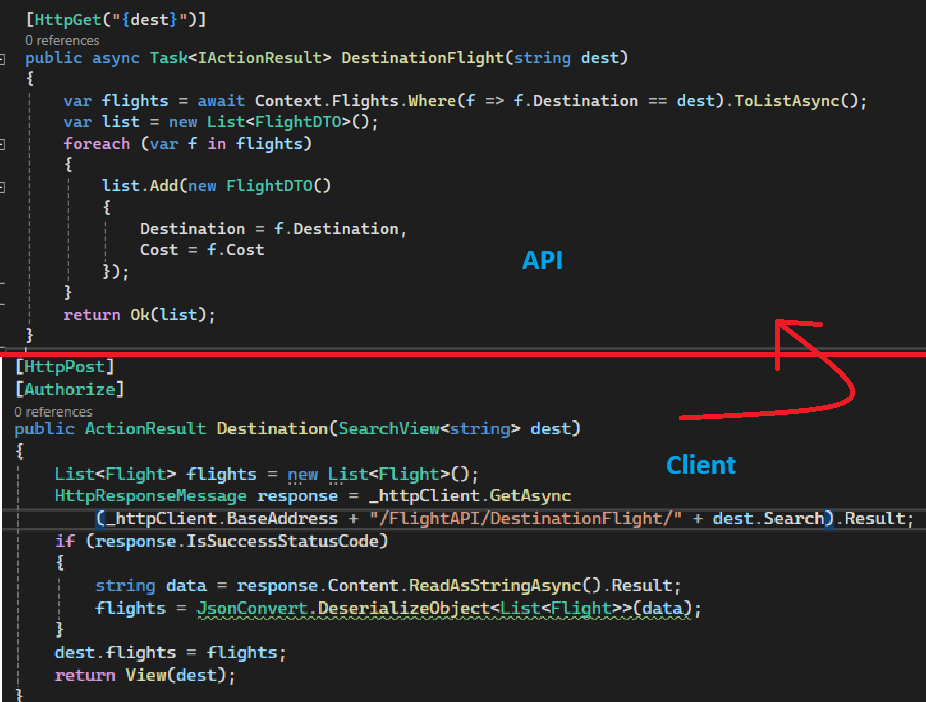
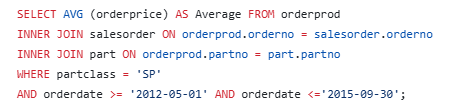
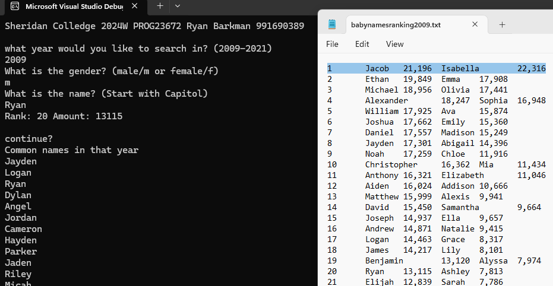
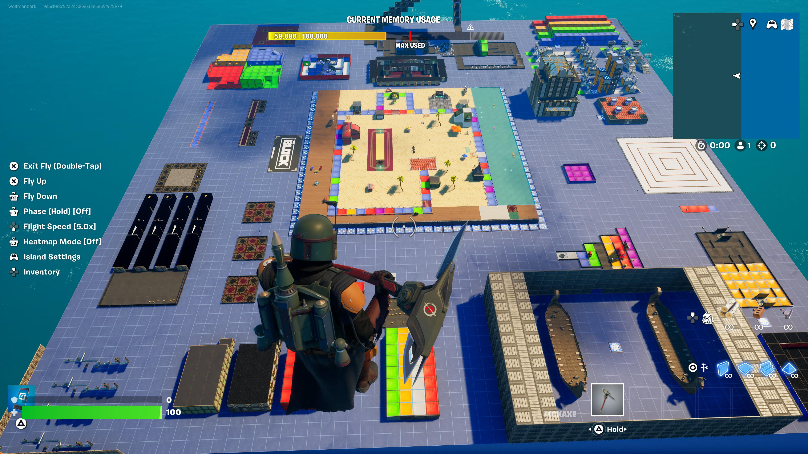
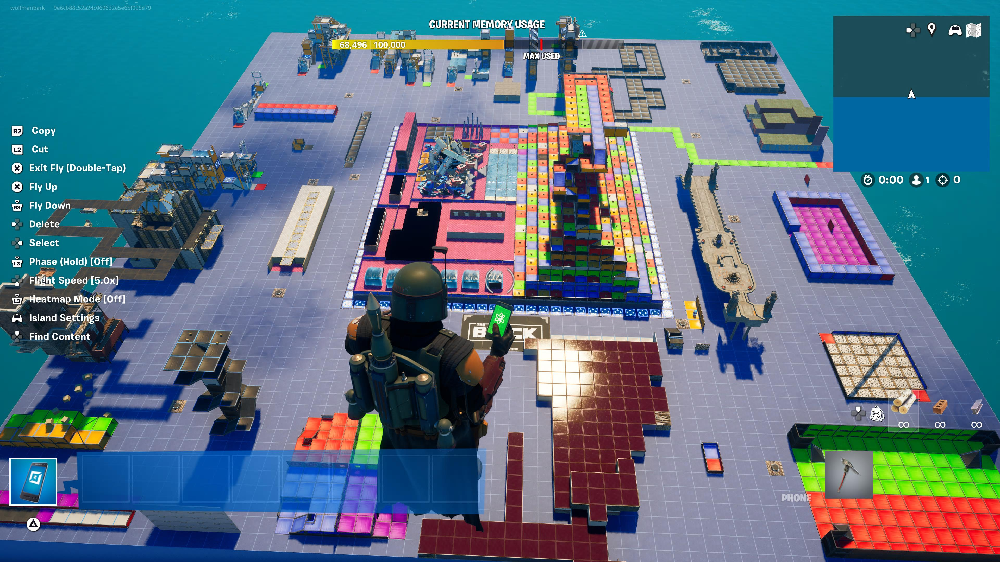

Ryan Barkman
# Education
## Sheridan College 
  -Honors Bachelor of Computer Science; Specialization in Game Engineering  
  -GPA: 3.71

# Projects
### Data Code
## Flight API:
[https://github.com/barkmanr/FlightAPI](https://github.com/barkmanr/FlightAPI)  
Enterprise Software exam project. 2-hour time limit. API Hold data base for client to use. Uses Swagger to test output of API. It uses DTO's to limit the data being viewed in specific requests. 3 features are all flights, add flights, and search for specific location. Client uses API through local address with JSON/HTTPResponseMessage data. Client Also holds identity users in which a user needs to be authenticated to add flights. 

 
## SQL STATEMENTS: [https://github.com/barkmanr/SQL_Statments](https://github.com/barkmanr/SQL_Statments)  
List of used SQL Statements used through out Database Modeling course showcasing my knowledge of SQL

 
Top Baby Names Sorter:
[https://github.com/barkmanr/Barkmanr.SortingBabyNames](https://github.com/barkmanr/Barkmanr.SortingBabyNames)  
Reads text files of the top baby names of a specific year. Formtat of text file is like this "(1	Jacob	21,196	Isabella	22,316)". The way it reads the file is by reading each line of text and then seperating each item by spaces. For the numbers it just seperates it by the comma. Three things this does is ask for a name, gender, and year; and it will give you the rank of it if in top 1000. Then it will get all the names that apear in both list. The last thing it does is show the top 10 unique names that the female and male names have. 

 

### Fortnite Maps
Mario Party:

   -Full Demo:   [https://www.youtube.com/watch?v=cPYZnt-eFCE](https://www.youtube.com/watch?v=cPYZnt-eFCE)
   -Board (pt1):  [https://www.youtube.com/watch?v=GeRZ4PKftDg](https://www.youtube.com/watch?v=GeRZ4PKftDg)
   -Games (pt2): [https://www.youtube.com/watch?v=a7lpB6bbvhI](https://www.youtube.com/watch?v=a7lpB6bbvhI)
 
Minigame Tower:

   -Full Demo: [https://www.youtube.com/watch?v=PVPvIZdaHJo](https://www.youtube.com/watch?v=PVPvIZdaHJo)
   -Board (pt1): [https://www.youtube.com/watch?v=eUh9Ul8Y3dk](https://www.youtube.com/watch?v=eUh9Ul8Y3dk)
   -Games (pt2): [https://www.youtube.com/watch?v=5jN2gWLrqRo](https://www.youtube.com/watch?v=5jN2gWLrqRo)

### Unreal Projects
  -Galaga Project: [https://www.youtube.com/watch?v=sE_Ui1PKXRE](https://www.youtube.com/watch?v=sE_Ui1PKXRE)
   
  -Infinite Runner: [https://www.youtube.com/watch?v=Tk3rWA-XoO4](https://www.youtube.com/watch?v=Tk3rWA-XoO4)

### VisualStudio Code
  -SDL_RPS: [https://github.com/barkmanr/SDLRPS](https://github.com/barkmanr/SDLRPS)
   
  -YULshaderfile: [https://github.com/barkmanr/Barkmanr.YULshaderfile](https://github.com/barkmanr/Barkmanr.YULshaderfile)
 
  -ConectingWall: [https://github.com/barkmanr/Barkmanr.ConnectingWall](https://github.com/barkmanr/Barkmanr.ConnectingWall)
