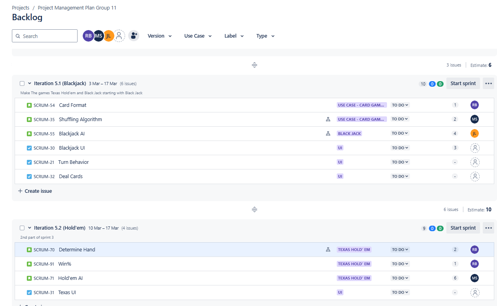
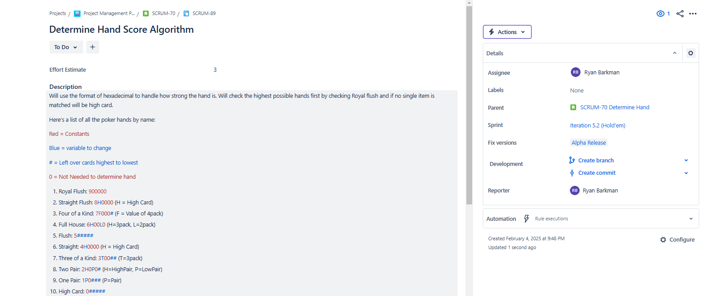

[Git Hub](https://github.com/barkmanr/Barkmanr.GithubPortfolio)
# Education
## Sheridan College 
  -Honors Bachelor of Computer Science; Specialization in Game Engineering  
  -GPA: 3.72

# Projects
 

### Unity Projects

Import them into Unity and run the scene included
## Shooting Galary
<a href="assets/ShootingGalary.unitypackage" download>
  Download the Project Files
</a>

## Tag Game
<a href="assets/Tag.unitypackage" download>
  Download the Project Files
</a>

## Nav-Meshs
<a href="assets/NavMesh.unitypackage" download>
  Download the Project Files
</a>

 
## Final Project: Custom Graphics Engine Demonstration
[https://github.com/barkmanr/GraphicsFinal](https://github.com/barkmanr/GraphicsFinal)
 
This project showcases a custom-built graphics engine that integrates multiple concepts learned throughout the course. The engine is structured around four distinct scenes, each demonstrating a different technical capability:  
#### Scene 1 – Rotating ASCII Ship with Interactive Lighting
The first scene features a rotating ASCII ship illuminated by a dynamic light source. The lighting is manipulated through shader code, allowing users to adjust the specular values, which in turn alters the ship’s appearance. The light source is responsive to mouse movements, transitioning smoothly from the center of the screen to the mouse's position. This demonstrates advanced shader manipulation and real-time light interaction.
 
#### Scene 2 – Transformable Ship with Interactive Lighting
In this scene, the user can modify the ship’s transformation (position, scale, and rotation), using the same lighting system from Scene 1. The ship responds to input, and the lighting adjusts accordingly, offering a cohesive experience between object manipulation and light interaction.
 
#### Scene 3 – ASCII Fish with Shader-based Post-Processing Effects
Scene 3 introduces an ASCII fish rendered within a water environment, where the user can dynamically apply post-processing effects via shader code. The available effects include a wavy distortion effect to simulate movement in water, a blue tint to evoke the underwater ambiance, and a solid line rendering style for a stylized look. These effects are customizable in real-time, highlighting proficiency in shader programming and post-processing techniques.
 
#### Scene 4 – Skybox with Multiple Fish in Space
The final scene uses a skybox to create an expansive space environment, populated with numerous fish, rendered in a surreal, outer-space setting. This scene demonstrates advanced scene composition.
   
This project not only demonstrates proficiency in shader programming and object transformation but also showcases a deep understanding of graphics rendering techniques, real-time user interaction, and creative application of custom-made graphics tools. By combining complex tasks, including dynamic lighting, user input handling, post-processing effects, and scene rendering, this project reflects a high level of skill and technical execution in the field of computer graphics. It also has the ability to combine Blender-rendered models with ASCII art within a single framework.
 

## Jira photos for Software Engineering project
Group of 3 project currently in-progress creating a fake gambling application in Unity.  
Going through full software engineering life cycle which includes requirement plaing, sprint planning, and risk analysis  
Games includede will be: Black Jack, Texas Hold'em, Slots, Roulette, and race betting  

Sprint backlog of Blackjack and Texas Hold'em  

Dev Subtask of Determine score of a hand by using 6 hexadecimal numbers  
Makes it easy to compare different hands  

## Flight API: [https://github.com/barkmanr/FlightAPI](https://github.com/barkmanr/FlightAPI)  
### Enterprise Software Exam Project
This project was completed under a 2-hour time limit and involves building an API that serves as a database for flight data. The API allows clients to interact with the data by providing three key features: listing all available flights, adding new flights, and searching for flights at specific locations.

To ensure smooth interaction, the project utilizes Swagger for testing the API endpoints and inspecting the responses. The data is managed through DTOs (Data Transfer Objects), which help control the amount of data exposed in each request for security and efficiency.

The client interacts with the API via a local address, receiving data in JSON format with HTTP Response Message structures. Additionally, the API includes user authentication using identity management. Only authenticated users are authorized to add new flights, ensuring controlled access to this functionality.

 

## SQL STATEMENTS: [https://github.com/barkmanr/SQL_Statments](https://github.com/barkmanr/SQL_Statments)  
This portfolio showcases my knowledge of SQL, featuring a range of statements used during the Database Modeling course. The list includes: Inner Joins, Subqueries, Triggers, Functions, If-Else Statements, Views, Temporary Tables, Ranks, Stored Procedures.

Additionally, I have included screenshots from an assignment, though I forgot to add the corresponding questions when answering them. Please note that the code may not run as intended since I no longer have access to the class database (which was provided by the instructor). However, the code remains intact for review, allowing you to see the work I've completed.

 
## Top Baby Names Sorter: [https://github.com/barkmanr/Barkmanr.SortingBabyNames](https://github.com/barkmanr/Barkmanr.SortingBabyNames)  
This application reads text files containing the top baby names of a specific year. The format of the text file is structured as follows: (1 Jacob 21,196 Isabella 22,316).

The app processes the file by reading each line, separating the items by spaces, and then parsing the numbers by commas. It offers three main features:  
**1) Rank Lookup** The user is prompted to input a name, gender, and year, and the application returns the rank of the name if it appears in the top 1000 for that year.  
**2) Common Names:** It identifies and displays all the names that appear in both the male and female lists for a given year. 
**3) Top 10 Unique Names:** The app shows the top 10 unique names, with separate lists for female and male names.

The application employs pointers and double pointers to manage names and numbers as linked lists, ensuring proper memory handling and disposal at the end of the program. This project demonstrates my skill in handling and manipulating data efficiently.

 

### Other VisualStudio Code
  -SDL_RPS: [https://github.com/barkmanr/SDLRPS](https://github.com/barkmanr/SDLRPS)
   
  -YULshaderfile: [https://github.com/barkmanr/Barkmanr.YULshaderfile](https://github.com/barkmanr/Barkmanr.YULshaderfile)
 
  -ConectingWall: [https://github.com/barkmanr/Barkmanr.ConnectingWall](https://github.com/barkmanr/Barkmanr.ConnectingWall)
   
  -Calculator Testing: [https://github.com/barkmanr/CalcTest](https://github.com/barkmanr/CalcTest)

### Unreal Projects
  -Galaga Project: [https://www.youtube.com/watch?v=sE_Ui1PKXRE](https://www.youtube.com/watch?v=sE_Ui1PKXRE)
   
  -Infinite Runner: [https://www.youtube.com/watch?v=Tk3rWA-XoO4](https://www.youtube.com/watch?v=Tk3rWA-XoO4)

### Fortnite Maps
Mario Party:

   -Full Demo:   [https://www.youtube.com/watch?v=cPYZnt-eFCE](https://www.youtube.com/watch?v=cPYZnt-eFCE)
 
Minigame Tower:

   -Full Demo: [https://www.youtube.com/watch?v=PVPvIZdaHJo](https://www.youtube.com/watch?v=PVPvIZdaHJo)
